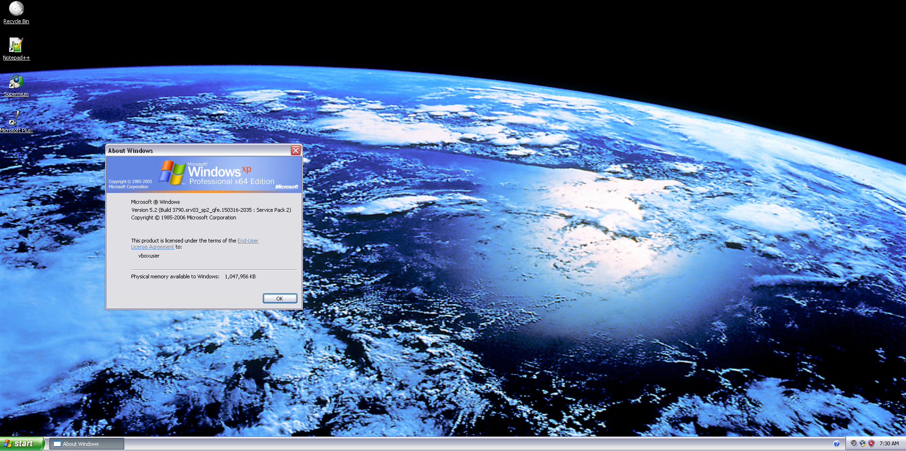

# Windows XP Virtual Image

This is a virtual [OVA 2.0](https://www.dmtf.org/standards/ovf) image of Windows XP, suitable for use with VirtualBox or VMWare. This image includes extras and does not require installation.

## Usage Instructions

1. **Download the Split Files**: Download all parts of the split archive.

2. **Combine the Files**: Use [7zip](https://7-zip.org/download.html) to combine the split files. Start by extracting `image/XP.ova.7z.001` into a single archive.

3. **Extract the Image**: Extract the virtual image from the combined archive.

   **Note**: The archive is password-protected. Use the following password to extract the files: `winxp_virtual_image`

4. **Import to Virtual Machine Software**: Import the extracted virtual image into your preferred virtual machine software (VirtualBox is recommended).

## System User Information

- **Username**: `Administrator`
- **Password**: `winxp_virtual_image`

## Screenshot

## Important Notes

- This virtual image is intended for educational or testing purposes only.
- Use at your own risk. The creator of this image is not responsible for any damage or data loss.

## Support

If you encounter any issues or have questions, please open an issue on this GitHub repository.

---

*Disclaimer: This virtual image is provided "as is" without warranty of any kind. Use at your own risk.*